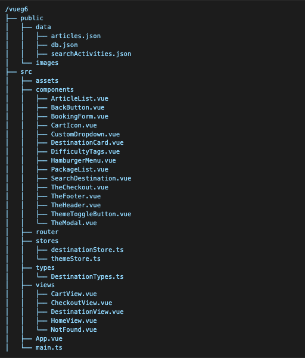

# SkiEase Application

## Overview

SkiEase is a Vue 3 application designed to help users book ski vacations with ease. It offers functionality to search for destinations, view detailed information about packages, and complete bookings through a seamless user interface. Built with a focus on scalability and user experience, the application uses modern tools and frameworks like Vue 3, Pinia, Tailwind CSS, and Headless UI.

## Features

1. **Search and Filter Destinations**

- _Users can search for ski destinations by location and filter by date ranges._

- _Integration of a dropdown using Headless UI for selecting destinations and date ranges._

- _Activities and destinations are fetched dynamically from the backend._

2. **Booking Functionality**

- **Users can select:**

- _Number of days for their trip._

- _Number of persons attending._

- _Desired arrival dates._

- _Booking details are validated in real-time to ensure accurate and complete information._

- _Users can view age categories for pricing and add custom details for their group._

3. **Dynamic Destination Pages**

- **Each destination has a detailed view that includes:**

- _Description of the destination._

- _Difficulty tags for activities._

- _Available packages with pricing._

- _Related articles for additional information._

- _A booking form integrated into the page for convenience._

4. **Cart and Checkout System**

- _Users can add multiple bookings to a cart._

- _The cart shows a detailed summary of each booking with options to update or remove items._

- _Total price is dynamically calculated and displayed._

5. **Responsive Design**

- _Fully responsive layout with a consistent user experience across devices._

- _Light and dark mode support._

6. **Data Persistence**

- _User selections and cart data are saved locally using Pinia’s persistence plugin._

- _Data remains intact even after the page is refreshed._

## Tech Stack

**Frontend**

- **Vue 3 with Composition API**

- **TypeScript for type safety**

- **Tailwind CSS for styling**

- **Headless UI for accessible and flexible UI components**

**State Management**

- **Pinia with Pinia Plugin Persistedstate for state management and local persistence**

**Backend**

**Static JSON files (mock backend):**

- **db.json: Contains destination data.**

- **searchActivities.json: Contains activities for search functionality.**

- **articles.json: Contains articles related to ski destinations.**

## Folder Structure


## Key Components

1. **HomeView.vue**

- **Displays popular destinations and articles.**

- **Integrates the SearchDestination and DestinationCard components.**

2. **DestinationView.vue**

- **Provides detailed information about a destination.**

- **Includes difficulty tags, available packages, and a booking form.**

- **Uses BookingForm, PackageList, and ArticleList components.**

3. **BookingForm.vue**

- **Allows users to configure their bookings.**

- **Validates input fields such as days, persons, and dates.**

- **Integrates with Pinia for cart management.**

4. **destinationStore.ts**

- **Centralized state management for destinations, articles, activities, and cart.**

- **Implements features such as fetching data, adding to cart, and calculating total price.**

## Installation

1. Clone the repository:

```
git clone https://github.com/Luayasaadsson/vueG6

cd vueG6
```

2. Install dependencies:

```
npm install
```

3. Start the development server:

```
npm run dev
```

4. Build for production:

```
npm run build
```

5. Preview production build:

```
npm run preview
```